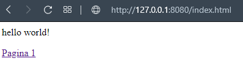

 ---
 layout: essay
 type: essay
 title: Virtual Brick
 All dates must be YYYY-MM-DD format!
 date: 2020
 labels:
   - HTTP
   - Python
   - Web Server
 ---

 

 Durante meu processo de amadurecimento no mundo do desenvolvimento, tive contato com o desenvolvimento web e fiquei bastante curioso de como a internet funcionava.
Para entender como o HTTP funcionava e de como servidores eram construídos, iniciei esse pequeno projeto com o intuito de aprender mais sobre web e servidores.
Todo o projeto foi desenvolvido em python com base no artigo [A Simple Web Server](http://aosabook.org/en/500L/a-simple-web-server.html) escrito por [Greg Wilson](https://twitter.com/gvwilson).

