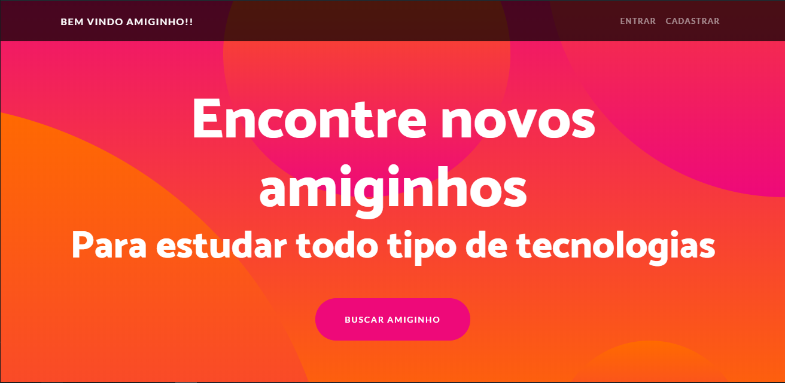

Busque Amiguinho foi um projeto iniciado por alguns desconhecidos durante uma live no twitch no canal do [jmarcolan] (https://www.twitch.tv/jmarcolan), a ideia e uma mini rede social onde você pode encontrar amigos para seus estudos e projetos.

Feito em Django e de código aberto, foi feito inteiramente sem fins lucrativos e pensado em ser um produto minimo viável sem muita pretensão.

Você pode acessar e usar o [Buque Amiguinho](https://busqueamiguinho.herokuapp.com) de forma gratuita em qualquer plataforma com acesso a internet. 
 
Código: <a href="https://github.com/talesmm14/Busque-o-seu-amiguinho"><i class="large github icon"></i>Busque Amiguinho</a>